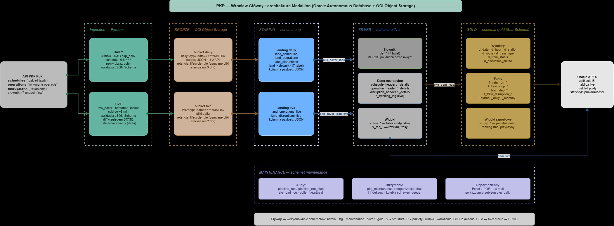

# PKP — Wrocław Główny

### Pipeline danych pobierający z API PKP PLK ruch pociągów na stacji Wrocław Główny — w trybie dziennym (batch) i na żywo (micro-batch co ok. 3 minuty) — i dostarczający przez architekturę Medallion w Oracle Autonomous Database statystyki punktualności gotowe do analizy BI.

**Autor:** Bartłomiej Okoniewski · [github.com/bokoniewski](https://github.com/bokoniewski)

---

## Stack technologiczny

| Obszar | Technologia |
|---|---|
| Chmura | Oracle Cloud Infrastructure (Always Free) |
| Baza danych | Oracle Autonomous Database 26ai |
| Magazyn plików | OCI Object Storage |
| Transformacje | PL/SQL (pakiet na warstwę) |
| Migracje schematu | Flyway |
| Orchestracja | Apache Airflow 2.9 |
| Ingestion | Python 3.12 · requests · jsonschema · OCI SDK |
| Sterownik DB | python-oracledb (thin mode) |
| Infrastruktura | Docker · Docker Compose |
| CI/CD | GitHub Actions · pytest · ruff · pip-audit · gitleaks |
| Raportowanie | ReportLab · openpyxl · SMTP |
| Aplikacja BI | Oracle APEX |

---

## Architektura — Medallion

[](docs/images/medallion_architecture.jpg)

Projekt implementuje architekturę Medallion na Oracle Autonomous Database. Surowe odpowiedzi API trafiają jako pliki JSON do Object Storage (Bronze), stamtąd do tabel landing w schemacie `stg`. Warstwa Silver rozbija JSON na model relacyjny, a Gold buduje na nim Star Schema z faktami dziennymi i miesięcznymi. Wyniki prezentuje aplikacja w Oracle APEX: tablica odjazdów i przyjazdów na żywo, rozkład jazdy i statystyki punktualności.

**Aplikacja dostępna na żywo:** [**PKP Wrocław Główny — tablica i statystyki**](https://example.com)

Główne założenia:

**Bronze jako pliki, nie tabele** — surowe dane leżą w buckecie z regułą lifecycle. Baza przechowuje tylko to, co jest odpytywane.

**Dwa tory na jednym modelu** — dzienny batch ładuje pełny obraz doby pod statystyki, poller live dosyła w ciągu dnia wyłącznie zmiany. Oba zapisują do warstwy Silver, więc tablica odjazdów i analizy historyczne korzystają z tych samych słowników i tego samego rozkładu.

**Udawany streaming z odpytywania** — API nie wysyła zdarzeń, tylko zwraca pełny snapshot. Poller porównuje go z poprzednim stanem i przekazuje dalej tylko rekordy, które się zmieniły.

**Idempotentność zamiast flag stanu** — słowniki ładowane przez `MERGE`, dane operacyjne jako insert-only-new, fakty Gold przeliczane dla okna ostatnich dni. Każdy krok można bezpiecznie uruchomić ponownie na tych samych danych.

**Transformacje w PL/SQL** — logika wykonuje się w bazie, przy danych, z pełną kontrolą transakcji: jedna warstwa to jeden `COMMIT` albo `ROLLBACK`.

**Struktura osobno od logiki** — Flyway wersjonuje tabele migracjami `V`, a pakiety i widoki są migracjami powtarzalnymi `R`, wdrażanymi przy każdej zmianie kodu.

| Warstwa | Lokalizacja | Odpowiedzialność |
|---|---|---|
| Bronze | bucket OCI | surowe JSON 1:1 z API |
| Staging | `stg.*` | landing JSON w bazie |
| Silver | `silver.*` | model relacyjny: słowniki, rozkłady, wykonanie kursów, utrudnienia, tracking live |
| Gold | `gold.*` | Star Schema, agregaty dzień / miesiąc |
| Maintenance | `maintenance.*` | audyt przebiegów, monitoring pollera, reorganizacja tabel i indeksów |

---

## Pipeline — przepływ

**Dzienny** (`DAG: pkp_daily`, `schedule: 0 6 * * *`) — Airflow steruje pełnym przebiegiem: ingest → upload → staging → Silver → Gold → maintenance → raport. Airflow został wybrany ze względu na jawne zależności między taskami i `trigger_rule`: błąd kroku zatrzymuje dalsze ładowanie, ale nie blokuje domknięcia audytu ani wysyłki raportu e-mail z podsumowaniem przebiegu.

**Live** (`live_poller`) — osobny, stale działający kontener, a nie DAG: cykl co ok. 3 minuty to praca dla serwisu, nie dla schedulera. Poller zapisuje swój stan dopiero po udanym uploadzie delty, więc nieudany cykl nie gubi danych — następny wylicza tę samą deltę ponownie.

**Audyt i monitoring** — każdy task DAG-a i każdy cykl pollera zostawia wiersz w schemacie `maintenance`. Z tych tabel powstaje codzienny raport utrzymaniowy (Excel + PDF).

**Wdrożenia** — CI na każdy push: testy, lint, skan sekretów i walidacja migracji Flyway na instancji DEV. CD uruchamiane ręcznie: migracja DEV, potem PROD za bramką akceptacji. Obraz Docker zawiera wyłącznie kod; konfiguracja, wallet i sekrety są montowane przy starcie.

Szczegółowy opis kroków, obsługi błędów i audytu: [docs/pipeline_flow.md](docs/pipeline_flow.md)

---

## Struktura repozytorium

```
PKP/
├── ingestion/        ← klient API, walidacja, upload do bucketu, ładowanie stagingu, poller live
├── load/             ← skrypty uruchamiające ładowanie Silver i Gold
├── migrations/       ← Flyway: admin, stg, silver, gold, maintenance (tabele, pakiety PL/SQL, widoki)
├── orchestration/    ← Airflow: DAG, audyt, raport, Dockerfile, Docker Compose
├── data/             ← lokalne katalogi robocze (TODO, ARCHIVE, ERR, STATE, RAPORT)
├── OCI/              ← miejsce na wallet połączeniowy (poza repozytorium)
├── requirements/     ← zależności Python
├── docs/             ← dokumentacja techniczna i runbooki
└── .github/          ← workflowy CI/CD
```

---

## Dokumentacja

| Plik | Opis |
|---|---|
| [docs/pipeline_flow.md](docs/pipeline_flow.md) | Kroki toru dziennego i live, obsługa błędów, audyt, maintenance |
| [docs/data_catalog.md](docs/data_catalog.md) | Katalog obiektów bazodanowych — tabele, widoki, pakiety i kolumny per schemat |
| [docs/data_model_operational.md](docs/data_model_operational.md) | ERD warstw Staging, Silver i Maintenance z decyzjami projektowymi |
| [docs/data_model_gold.md](docs/data_model_gold.md) | Star Schema warstwy Gold — wymiary, fakty, partycjonowanie |
| [docs/naming_conventions.md](docs/naming_conventions.md) | Konwencje nazewnicze obiektów, migracji i plików |
| [docs/plsql_conventions.md](docs/plsql_conventions.md) | Konwencje pakietów PL/SQL i wzorce ładowania |
| [docs/runbooks/](docs/runbooks/) | Runbooki wdrożeniowe: infrastruktura OCI, migracje Flyway, CI/CD, Docker |
