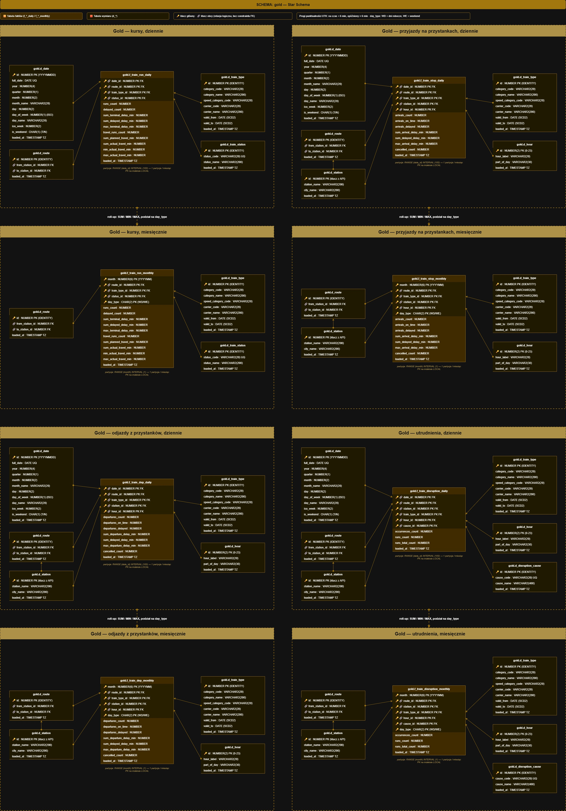

# Model danych — warstwa Gold

Star Schema w schemacie `gold`: 7 wymiarów i 8 tabel faktów. Kolumny wszystkich tabel: [data_catalog.md](data_catalog.md).

---

## Fakty

Cztery obszary analityczne, każdy w dwóch ziarnach czasowych:

| Obszar | Fakt dzienny | Fakt miesięczny | Co mierzy |
|---|---|---|---|
| Kursy | `f_train_run_daily` | `f_train_run_monthly` | opóźnienie na stacji końcowej, czas przejazdu, kursy odwołane |
| Przyjazdy | `f_train_stop_daily` | `f_train_stop_monthly` | punktualność przyjazdów na każdy przystanek |
| Odjazdy | `f_train_dep_daily` | `f_train_dep_monthly` | punktualność odjazdów z każdego przystanku |
| Utrudnienia | `f_train_disruption_daily` | `f_train_disruption_monthly` | liczba wystąpień według przyczyny |

### Ziarno

| Fakt | Wymiary |
|---|---|
| `f_train_run_*` | data, trasa, typ pociągu, status |
| `f_train_stop_*`, `f_train_dep_*` | data, trasa, typ pociągu, stacja, godzina |
| `f_train_disruption_*` | data, trasa, stacja, typ pociągu, godzina, przyczyna |

Fakty miesięczne mają `month` (YYYYMM) zamiast `date_id` oraz dodatkowy atrybut `day_type` (`WD` = dni robocze, `WE` = weekend).

**Dlaczego osobne fakty dla kursów i przystanków:** to dwa różne pytania. „Czy pociąg dojechał na czas” ocenia się na stacji końcowej — jeden wynik na kurs. „O której godzinie stacja ma największe opóźnienia” wymaga wiersza na każdy przystanek. Jeden fakt o mieszanym ziarnie zmuszałby do pilnowania w każdym zapytaniu, żeby nie policzyć kursu wielokrotnie.

**Dlaczego osobne fakty dla przyjazdów i odjazdów:** stacja początkowa nie ma przyjazdu, końcowa nie ma odjazdu, a godzina planowa bywa inna dla każdego z nich. Dwie symetryczne tabele są prostsze niż jedna z kolumną kierunku i pustymi miarami.

### Miary

Fakty przechowują wyłącznie miary addytywne: liczniki, sumy oraz minimum i maksimum.

**Dlaczego nie ma średnich ani procentów:** średniej nie da się poprawnie zagregować dalej — średnia ze średnich dziennych nie jest średnią miesięczną. Suma i licznik agregują się zawsze, a średnią i procent liczą widoki `v_rep_*` przy odczycie.

Progi punktualności są zgodne z definicją UTK: kurs jest na czas przy opóźnieniu do 5 min, opóźniony od 6 min. Przystanek potwierdzony bez podanego opóźnienia liczy się jako 0 min.

Kursy odwołane mają w `f_train_run_*` miary opóźnień równe `NULL` i są rozpoznawane po tym, a nie po kodzie statusu. Mianownikiem punktualności są kursy zrealizowane; odwołane raportuje się osobno.

### Roll-up miesięczny

Fakty miesięczne są przeliczane z dziennych, nie z Silver.

**Dlaczego:** jedna definicja miar. Logika „co jest opóźnieniem” istnieje tylko w ładowaniu faktu dziennego, a miesiąc jest sumą dni. Dzień i miesiąc nie mogą się rozjechać.

**Dlaczego `day_type` w fakcie miesięcznym:** ruch w dni robocze i w weekendy różni się na tyle, że to podstawowy przekrój analiz. Po zagregowaniu do miesiąca tej informacji nie da się już odzyskać z daty.

**Dlaczego w ogóle fakty miesięczne:** raporty miesięczne i rankingi tras czytają wielokrotnie mniej wierszy niż z faktu dziennego, co ma znaczenie na instancji Always Free.

---

## Wymiary

| Wymiar | Klucz | Uwagi |
|---|---|---|
| `d_date` | `id` = YYYYMMDD | generowany; atrybuty kalendarza, ISO dzień tygodnia, flaga weekendu |
| `d_hour` | `id` = 0–23 | generowany; etykieta przedziału i pora dnia |
| `d_station` | `id` z API | nazwa stacji i miasta |
| `d_route` | sztuczny | relacja: stacja początkowa → końcowa |
| `d_train_type` | sztuczny | kategoria handlowa × wersja przewoźnika, SCD2 |
| `d_train_status` | sztuczny | status kursu |
| `d_disruption_cause` | sztuczny | przyczyna utrudnienia |

### Klucze

`d_date`, `d_hour` i `d_station` mają klucze naturalne. `date_id = 20261006` jest czytelny bez złączenia, pozwala partycjonować fakt po liczbie i filtrować zakres dat bez sięgania do wymiaru.

Pozostałe wymiary mają klucze sztuczne (`IDENTITY`), bo ich klucz naturalny jest złożony albo tekstowy.

### `d_route`

Trasa to para stacji: pierwsza i ostatnia w planie kursu (najmniejszy i największy `order_number`). Nie jest to numer pociągu ani linia.

**Dlaczego tak:** API nie podaje identyfikatora trasy. Para stacji końcowych jest stabilna i odpowiada temu, jak pasażer nazywa połączenie („Wrocław – Warszawa”). Kursy o tej samej relacji, ale innym przebiegu, trafiają do jednej trasy.

Ładowanie dzienne dopisuje tylko trasy kursów z bieżącego dnia; tryb pełny (`p_full_load`) przelicza całą historię rozkładu i służy do pierwszego zasilenia.

### `d_train_type` — SCD2

Wymiar łączy kategorię handlową (np. EIC, Os) z przewoźnikiem. Kategoria jest nadpisywana (Type 1), przewoźnik jest wersjonowany (Type 2) z okresem `valid_from` – `valid_to`, przejętym z `silver.def_carrier`.

Fakt wskazuje wersję obowiązującą w dniu kursu, więc statystyki historyczne pokazują nazwę przewoźnika z tamtego okresu.

### Wymiary a fakty miesięczne

Fakty miesięczne nie mają klucza do `d_date` — `month` jest liczbą YYYYMM. Wymiar daty o ziarnie dnia nie pasuje do faktu o ziarnie miesiąca, a osobny wymiar miesiąca niczego by nie wnosił.

---

## Partycjonowanie

| Fakty | Definicja | Efekt |
|---|---|---|
| dzienne | `RANGE (date_id) INTERVAL (100)` | jedna partycja na miesiąc (YYYYMMDD rośnie o 100 między miesiącami) |
| miesięczne | `RANGE (month) INTERVAL (1)` | jedna partycja na miesiąc |

Partycje tworzą się automatycznie. Klucz główny każdego faktu jest na indeksie `LOCAL`.

**Dlaczego partycje miesięczne:** zapytania raportowe filtrują po miesiącu, więc czytają jedną partycję. Ładowanie dotyka tylko partycji bieżącej (i poprzedniej na przełomie miesiąca), a kompresję starszych partycji można robić bez ruszania danych bieżących.

---

## Ładowanie

| Obiekt | Sposób |
|---|---|
| wymiary generowane | `INSERT … WHERE NOT EXISTS` |
| wymiary ze Silver | `MERGE` |
| fakty dzienne | `DELETE` okna ostatnich dni + `INSERT` |
| fakty miesięczne | `DELETE` miesięcy objętych oknem + `INSERT` z faktów dziennych |

Okno to `gold_days_back` dni wstecz (domyślnie 3), do wczoraj włącznie. Fakty miesięczne są przeliczane dla pełnych miesięcy, których dotyka okno.

Tabele faktów nie mają kluczy obcych do wymiarów. Spójność zapewnia ładowanie: wiersz, dla którego nie da się ustalić trasy, typu pociągu albo statusu, nie trafia do faktu.

---

## Weryfikacja faktów

Widoki `v_run_daily_trace`, `v_stop_daily_trace` i `v_disruption_daily_trace` pokazują wiersze Silver z policzonymi kluczami Gold. Filtrując po tych samych identyfikatorach co w fakcie, widać, które kursy lub przystanki złożyły się na daną komórkę, a które zostały odrzucone (`in_fact = 'N'`).

**Dlaczego:** agregat nie pokazuje, z czego powstał. Widok trace pozwala sprawdzić dowolną liczbę z raportu aż do pojedynczego kursu, bez pisania zapytania diagnostycznego od zera.

Lista widoków raportowych: [data_catalog.md](data_catalog.md#3-schemat-gold).
