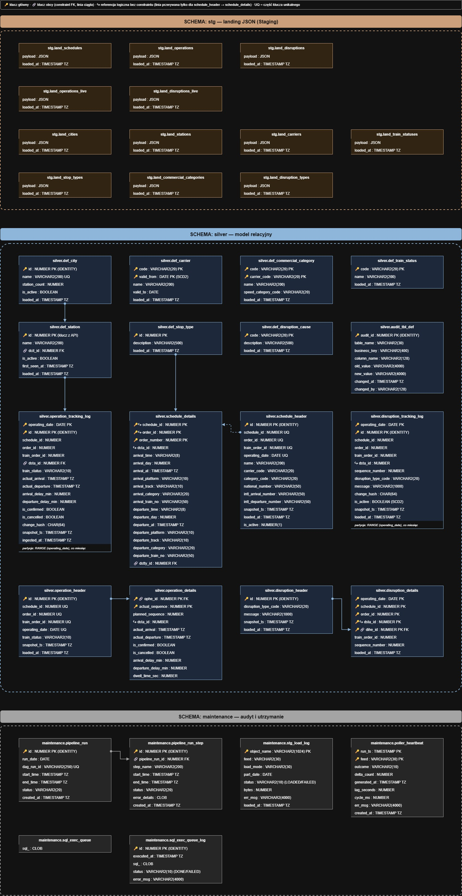

# Model danych — warstwy operacyjne

Schematy `stg`, `silver` i `maintenance`. Kolumny wszystkich tabel: [data_catalog.md](data_catalog.md).

Linia ciągła na diagramie oznacza klucz obcy założony w bazie, linia przerywana i symbol ↪ oznaczają relację logiczną bez constraintu.

---

## Staging (`stg`)

12 tabel `land_*` o identycznej strukturze: `payload` (typ `JSON`) i `loaded_at`. Jeden wiersz to jeden plik z bucketu.

**Dlaczego surowy JSON w bazie, bez parsowania w Pythonie:** rozbicie dokumentu na wiersze robi `JSON_TABLE` w PL/SQL, w tej samej transakcji co zapis do Silver. Python tylko przenosi plik. Zmiana mapowania pól nie wymaga wtedy nowej wersji obrazu Docker, tylko migracji pakietu.

**Dlaczego osobne tabele `*_live`:** delta z pollera ma inną strukturę niż pełny snapshot dzienny (dla utrudnień: listy `changed` i `ended`) i jest ładowana innym pakietem.

---

## Silver (`silver`)

### Słowniki `def_*`

Siedem słowników z API, ładowanych przez `MERGE` po kluczu biznesowym.

- **Klucze z API zamiast sztucznych.** `def_station.id`, `def_stop_type.id` i kody (`def_train_status.code`, `def_disruption_cause.code`) to identyfikatory źródła. Dane operacyjne przychodzą z tymi samymi identyfikatorami, więc ładowanie nie potrzebuje kroku tłumaczenia kluczy.
- **`def_carrier` w modelu SCD2.** Klucz to `code` + `valid_from`, a `valid_to = 2999-12-31` oznacza wersję bieżącą. Nazwa przewoźnika może się zmienić, a statystyki historyczne mają pokazywać nazwę obowiązującą w dniu kursu.
- **`is_active` i `first_seen_at` w `def_station`.** Stacja, która znika z API, nie jest usuwana, bo odwołują się do niej dane historyczne.
- **Audyt zmian.** Triggery `trg_def_*_audit` zapisują do `audit_tbl_def` każdą faktycznie zmienioną kolumnę (stara i nowa wartość). `MERGE` nadpisuje słownik bez śladu — audyt ten ślad zostawia.

### Rozkład jazdy

| Tabela | Ziarno | Klucz |
|---|---|---|
| `schedule_header` | kurs w dniu kursowania | unikalny: `operating_date`, `schedule_id`, `order_id`, `train_order_id` |
| `schedule_details` | przystanek planu | `schedule_id`, `order_id`, `order_number` |

**Dlaczego nie ma klucza obcego między nimi:** ten sam plan (`schedule_id`, `order_id`) obowiązuje w wielu dniach kursowania. Nagłówek ma wiersz na każdy dzień, a przystanki planu są zapisane raz. Para (`schedule_id`, `order_id`) nie jest więc w nagłówku unikalna i nie może być celem klucza obcego. Tabele łączy się po tych dwóch kolumnach: wiele nagłówków do jednego zestawu przystanków.

Zysk: przystanki planu nie są kopiowane dla każdego dnia kursowania.

Identyfikatory z API:

- `schedule_id` — edycja rozkładu (stała w ramach rocznego rozkładu),
- `order_id` — wersja treści planu; zmienia się, gdy plan się zmienia,
- `train_order_id` — stabilna tożsamość kursu,
- `order_number` — kolejność przystanku; luki i wartości ujemne (odcinki zagraniczne) są zachowane tak, jak podaje API.

Godziny planowe są przechowywane jako tekst `HH24:MI:SS` z osobnym offsetem dnia (`arrival_day`, `departure_day`), bo plan nie ma daty — kurs przez północ ma offset 1. Pełny znacznik czasu (`arrival_at`, `departure_at`) jest wyliczany.

### Wykonanie kursów

| Tabela | Ziarno | Klucz |
|---|---|---|
| `operation_header` | wykonany kurs w dniu | unikalny: `operating_date`, `schedule_id`, `order_id`, `train_order_id` |
| `operation_details` | przystanek wykonanego kursu | `ophe_id`, `actual_sequence` |

Tu klucz obcy istnieje (`operation_details.ophe_id` → `operation_header.id`, `ON DELETE CASCADE`), bo wykonanie zawsze dotyczy jednego konkretnego dnia.

Opóźnienia (`arrival_delay_min`, `departure_delay_min`) i czas postoju (`dwell_time_sec`) są liczone przy ładowaniu i zapisane w tabeli. Każdy raport i każdy fakt Gold korzysta z tej samej, raz policzonej wartości.

### Utrudnienia

`disruption_header` (jedno utrudnienie: kod przyczyny albo sam komunikat) i `disruption_details` (przystanki kursów dotknięte utrudnieniem), połączone kluczem obcym z kaskadowym usuwaniem.

### Tracking live

| Tabela | Model | Wykrywanie zmian |
|---|---|---|
| `operation_tracking_log` | append-only: nowa wersja przy każdej zmianie stanu kursu na stacji | `change_hash` |
| `disruption_tracking_log` | SCD2: `is_active` wskazuje bieżącą wersję | `change_hash` |

Obie tabele są partycjonowane po `operating_date` (jedna partycja na miesiąc) z kluczem głównym na indeksie `LOCAL`.

**Dlaczego osobne tabele, a nie aktualizacja `operation_details`:** tor live zapisuje historię zmian (kiedy opóźnienie wzrosło, kiedy kurs odwołano), a tor dzienny — stan końcowy doby. To dwa różne ziarna. Rozdzielenie pozwala też obu torom działać niezależnie: błąd pollera nie psuje danych dziennych i odwrotnie.

**Dlaczego dwa znaczniki czasu:** `snapshot_ts` to czas wygenerowania danych przez API (event time), `ingested_at` to czas zapisu w bazie (processing time). Różnica pokazuje opóźnienie pipeline'u.

**Dlaczego indeks `LOCAL`:** usunięcie starej partycji nie wymaga przebudowy indeksu.

### Brak kluczy obcych do słowników

Kolumny `dsta_id`, `carrier_code`, `category_code` i `train_status` w danych operacyjnych wskazują na słowniki logicznie, ale w większości bez constraintu.

**Dlaczego:** API potrafi przysłać w danych operacyjnych stację, której nie ma jeszcze w słowniku. Klucz obcy odrzuciłby wtedy cały kurs. Ważniejsze jest przyjęcie danych niż wymuszenie spójności, a brakujące wpisy uzupełnia kolejne ładowanie słowników.

---

## Maintenance (`maintenance`)

| Obszar | Tabele | Rola |
|---|---|---|
| Audyt przebiegów | `pipeline_run`, `pipeline_run_step` | jeden wiersz na przebieg DAG-a i na każdy task, ze statusem i treścią błędu |
| Idempotentność ładowania | `stg_load_log` | jeden wiersz na plik z bucketu; `LOADED` blokuje ponowne załadowanie, `FAILED` uruchamia ponowienie |
| Monitoring pollera | `poller_heartbeat` | jeden wiersz na cykl i feed: wynik, lag, czas cyklu |
| Utrzymanie | `sql_exec_queue`, `sql_exec_queue_log` | kolejka poleceń DDL i historia ich wykonania |

**Dlaczego osobny schemat:** dane techniczne mają inny cykl życia niż dane biznesowe. Osobny schemat oddziela uprawnienia i pozwala wyczyścić lub odtworzyć warstwę danych bez utraty historii przebiegów.

Szczegóły działania audytu, bramki `stg_load_log` i kolejki: [pipeline_flow.md](pipeline_flow.md).
