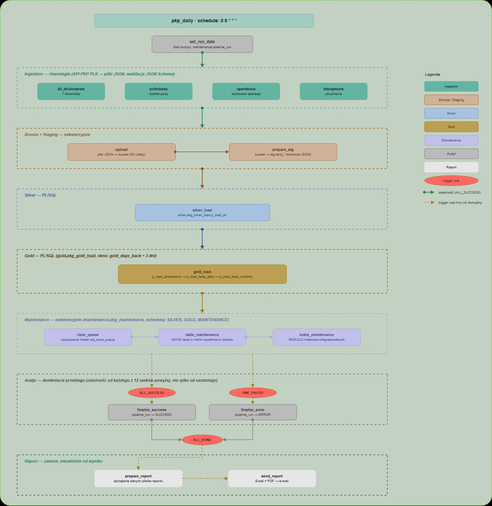
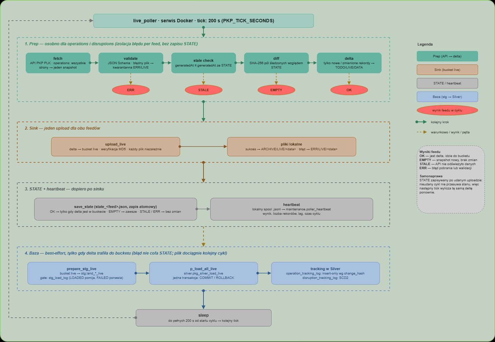

# Pipeline — przepływ

Pipeline ma dwa niezależne tory, które zapisują do tych samych tabel warstwy Silver:

| Tor | Uruchamianie | Zakres danych | Cel |
|---|---|---|---|
| **DAILY** | Airflow, DAG `pkp_daily`, `0 6 * * *` | pełny obraz doby | statystyki historyczne (Gold) |
| **LIVE** | serwis `live_poller` w kontenerze Docker, cykl co 200 s | tylko zmiany od poprzedniego cyklu | tablica odjazdów i przyjazdów na żywo |

**Dlaczego dwa tory:** API PKP PLK nie wysyła zdarzeń — dane trzeba odpytywać. Batch dzienny daje kompletny, zweryfikowany obraz doby pod agregaty. Poller live dosyła zmiany w ciągu dnia, żeby dane operacyjne nie czekały do następnego poranka. Rozdzielenie pozwala każdemu torowi mieć własną obsługę błędów i własny rytm.

---

## 1. Tor DAILY — DAG `pkp_daily`



### Kroki

| # | Task | Co robi |
|---|---|---|
| 1 | `set_run_date` | zakłada wiersz w `maintenance.pipeline_run` (status `PENDING`), przekazuje `pipeline_run_id` przez XCom |
| 2 | `all_dictionaries` | pobiera 7 słowników z API |
| 2 | `schedules` | rozkład jazdy, okno D-2 … D+7 |
| 2 | `operations` | wykonanie kursów, snapshot z API (paginowany, pełne trasy) |
| 2 | `disruptions` | utrudnienia, okno D-3 … D-1 |
| 3 | `upload` | pliki JSON z `TODO/DAILY` → bucket OCI (daily) |
| 4 | `prepare_stg` | bucket → tabele `stg.land_*` |
| 5 | `silver_load` | `silver.pkg_silver_load.p_load_all` |
| 6 | `gold_load` | `gold.pkg_gold_load`: wymiary → fakty dzienne → fakty miesięczne |
| 7 | `clear_queue` | czyści kolejkę `maintenance.sql_exec_queue` |
| 8 | `table_maintenance` | `MOVE` tabel o niskim wypełnieniu bloków |
| 9 | `index_maintenance` | `REBUILD` zdegradowanych indeksów |
| 10 | `finalize_success` / `finalize_error` | domyka `pipeline_run` statusem `SUCCESS` albo `ERROR` |
| 11 | `prepare_report` → `send_report` | raport utrzymaniowy (Excel + PDF) wysyłany e-mailem |

Taski z kroku 2 działają równolegle, pozostałe sekwencyjnie.

### Ingestion (krok 2)

Każdy task pobiera dane z API, waliduje je schematem JSON Schema (`ingestion/pkp_ingestion/schemas/`) i zapisuje plik do `data/<ENV>/TODO/DAILY`. Plik, który nie przechodzi walidacji, trafia do `ERR/DAILY/<data>` razem z opisem błędu i nie idzie dalej.

**Dlaczego walidacja przed zapisem:** zmiana struktury odpowiedzi API ma zostać wykryta na wejściu, a nie jako błąd parsowania JSON w PL/SQL kilka kroków później.

### Upload do Bronze (krok 3)

Każdy plik jest wysyłany niezależnie, z weryfikacją sumy MD5. Po sukcesie plik przechodzi do `ARCHIVE/DAILY/<data>`, po błędzie do `ERR/DAILY/<data>`. Błąd jednego pliku nie przerywa pozostałych.

Ścieżka obiektu w buckecie: `daily/<data|dict>/<typ>/date=YYYYMMDD/<plik>`. Partycja `date=` to data pobrania.

### Staging (krok 4)

`prepare_stg` czyta pliki z bucketu i wstawia je do tabel `stg.land_*` jako jedną kolumnę typu `JSON`.

- **Bramka `maintenance.stg_load_log`:** plik ze statusem `LOADED` jest pomijany, plik `FAILED` jest ponawiany przy kolejnym przebiegu.
- **Landing jako scratch:** tabela jest czyszczona (`TRUNCATE`) i dostaje wyłącznie pliki jeszcze niezaładowane.
- **Commit per plik:** wstawienie danych i wpis `LOADED` są w jednej transakcji.

**Dlaczego bramka w tabeli, a nie flaga w pliku:** stan ładowania jest w bazie, obok danych, więc ponowne uruchomienie tasku nie załaduje tego samego pliku drugi raz i nie wymaga żadnej ręcznej naprawy.

### Silver (krok 5)

`p_load_all` uruchamia procedury w ustalonej kolejności i zamyka całość jednym `COMMIT` (błąd = `ROLLBACK` całego kroku):

1. słowniki `def_*` — `MERGE` po kluczu biznesowym,
2. `schedule_header` → `schedule_details`,
3. `operation_header` → `operation_details`,
4. `disruption_header` → `disruption_details`,
5. odświeżenie widoków zmaterializowanych pod raporty.

Dane operacyjne są ładowane jako insert-only-new (`INSERT … WHERE NOT EXISTS`). Wyjątkiem jest `schedule_header`: oprócz dopisania nowych kursów ładowanie aktualizuje flagę `is_active` — plan, którego nie ma już w oknie dat z bieżącej paczki, zostaje oznaczony jako nieaktualny.

**Dlaczego jedna transakcja:** nagłówki i szczegóły muszą być spójne. Częściowo załadowany Silver byłby gorszy niż Silver z wczoraj.

### Gold (krok 6)

Trzy wywołania, każde z własnym `COMMIT`:

1. `p_load_dimensions` — wymiary: generowane (`d_date`, `d_hour`) przez idempotentny `INSERT`, pozostałe przez `MERGE`; `d_train_type` w modelu SCD2.
2. `p_load_facts_daily(gold_days_back)` — fakty dzienne dla okna ostatnich dni: `DELETE` okna + `INSERT`.
3. `p_load_facts_monthly(gold_days_back)` — roll-up miesięcy, których dotyczy okno.

Parametr DAG-a `gold_days_back` (domyślnie 3) ustala szerokość okna.

**Dlaczego okno, a nie tylko wczoraj:** dane o wykonaniu kursów i utrudnieniach potrafią uzupełniać się z opóźnieniem. Przeliczenie kilku ostatnich dni koryguje fakty bez osobnego mechanizmu poprawek, a `DELETE` + `INSERT` czyni krok idempotentnym.

### Maintenance (kroki 7–9)

Pakiet `maintenance.pkg_maintenance` analizuje schematy `SILVER`, `GOLD` i `MAINTENANCE`, generuje polecenia DDL do wspólnej kolejki `sql_exec_queue` i wykonuje je, logując wynik każdego polecenia w `sql_exec_queue_log`.

- `table_maintenance` — `ALTER TABLE … MOVE` dla tabel powyżej progu rozmiaru i poniżej progu wypełnienia bloków.
- `index_maintenance` — `REBUILD` indeksów powyżej progu degradacji.

Tabele idą przed indeksami, bo `MOVE` unieważnia indeksy tabeli.

**Dlaczego kolejka zamiast wykonania od razu:** oddzielenie analizy od wykonania zostawia w bazie pełny ślad — co zostało wygenerowane, co się wykonało i z jakim błędem. Executor nie przerywa na pierwszym błędzie, tylko wykonuje resztę i zgłasza błąd na końcu.

### Obsługa błędów

Taski od `upload` do `index_maintenance` mają domyślny trigger rule: błąd wcześniejszego kroku zatrzymuje kolejne. Niezależnie od wyniku wykonują się:

| Task | Trigger rule | Rola |
|---|---|---|
| `finalize_success` | `ALL_SUCCESS` | status `SUCCESS` w `pipeline_run` |
| `finalize_error` | `ONE_FAILED` | status `ERROR` w `pipeline_run` |
| `prepare_report`, `send_report`, `keepalive_dev` | `ALL_DONE` | raport zawsze |

Oba taski `finalize_*` zależą od każdego z 12 tasków przebiegu, nie tylko od ostatniego.

**Dlaczego raport zawsze:** e-mail jest jedynym powiadomieniem o stanie pipeline'u. Raport po nieudanym przebiegu jest ważniejszy niż po udanym.

### Audyt

Każdy task jest rejestrowany w `maintenance.pipeline_run_step` przez callbacki Airflow ustawione w `default_args`:

| Callback | Status kroku |
|---|---|
| `pre_execute` | `PENDING` |
| `on_success_callback` | `SUCCESS` |
| `on_failure_callback` | `ERROR` + treść błędu |
| `on_skipped_callback` | `SKIPPED` |

**Dlaczego własne tabele, skoro Airflow ma historię:** audyt w bazie danych można łączyć SQL-em z resztą danych (rozmiary schematów, logi ładowania) i z niego powstaje raport dzienny. Metadane Airflow żyją w osobnej bazie Postgres i znikają razem z kontenerem.

### Raport utrzymaniowy

`send_report` generuje i wysyła e-mailem (SMTP) trzy załączniki:

| Plik | Zawartość |
|---|---|
| `report_steps_*.xlsx` | kroki przebiegu z czasami i statusami |
| `report_schema_sizes_*.xlsx` | rozmiary obiektów per schemat |
| `summary_*.pdf` | podsumowanie: zajętość bazy, buckety, zużycie limitu API |

### Keep-alive DEV

Instancja DEV nie ma własnego ruchu (poller i DAG działają na PROD), a Always Free Autonomous Database zatrzymuje się po 7 dniach bez aktywności. `keepalive_dev` otwiera raz dziennie sesję na DEV, żeby walidacja migracji w CI miała zawsze dostępną bazę.

---

## 2. Tor LIVE — `live_poller`



Poller działa jako stale uruchomiony kontener (`restart: unless-stopped`), nie jako DAG.

**Dlaczego nie Airflow:** cykl co ok. 3 minuty to praca dla serwisu. DAG o takiej częstotliwości zaśmieca historię przebiegów i obciąża scheduler, a nic nie zyskuje.

### Cykl

Jeden cykl obsługuje dwa feedy: `operations` i `disruptions`.

**1. Prep (osobno dla każdego feedu)**

1. pobranie snapshotu z API (`operations`: wszystkie strony sklejone w jeden snapshot),
2. walidacja JSON Schema — błędny plik trafia do `ERR/LIVE/<data>`,
3. sprawdzenie świeżości: `generatedAt` nie nowszy niż w `STATE` kończy feed wynikiem `STALE`,
4. diff względem `STATE`: SHA-256 skanonikalizowanych pól śledzonych,
5. zapis delty (tylko nowe i zmienione rekordy) do `TODO/LIVE/DATA`.

**2. Upload**

Jeden upload dla obu feedów do bucketu live, z weryfikacją MD5. Pliki lokalne przechodzą do `ARCHIVE/LIVE/<data>` albo `ERR/LIVE/<data>`.

**3. STATE i heartbeat**

`STATE` (`state_<feed>.json`) jest zapisywany dopiero po uploadzie, atomowo (plik tymczasowy + `os.replace`).

**4. Baza**

Wykonywane tylko wtedy, gdy delta trafiła do bucketu:

1. `prepare_stg_live` — bucket live → `stg.land_*_live`, z tą samą bramką `stg_load_log` co w torze dziennym,
2. `silver.pkg_silver_load_live.p_load_all_live` — w jednej transakcji:
   - `operation_tracking_log` — insert-only według `change_hash`,
   - `disruption_tracking_log` — model SCD2 (dezaktywacja starych wersji, zamknięcie zakończonych utrudnień).

Po cyklu poller czeka do pełnych 200 s od startu (`PKP_TICK_SECONDS`).

### Wyniki feedu

| Wynik | Znaczenie | `STATE` |
|---|---|---|
| `OK` | jest delta i trafiła do bucketu | zapisany |
| `EMPTY` | snapshot nowy, ale bez zmian | zapisany |
| `STALE` | API nie odświeżyło danych | bez zmian |
| `ERR` | błąd pobrania, walidacji albo uploadu | bez zmian |

### Odporność na błędy

- **`STATE` po uploadzie.** Nieudany upload nie przesuwa stanu, więc następny cykl wylicza tę samą deltę ponownie. Nie ma osobnej kolejki ponowień.
- **Izolacja per feed.** Wyjątek w jednym feedzie nie zatrzymuje drugiego.
- **Niepełny snapshot = brak diffu.** Jeżeli którakolwiek strona `operations` jest błędna, cały feed kończy się `ERR`. Diff na częściowych danych pokazałby fałszywe zmiany.
- **Baza jako best-effort.** Błąd ładowania do bazy nie cofa `STATE` ani uploadu. Delta leży w buckecie, a bramka `stg_load_log` dociągnie ją w kolejnym cyklu.
- **Okno dwóch partycji.** `prepare_stg_live` czyta partycje `date=` z dziś i wczoraj, żeby nie zgubić delt z przełomu północy.

**Dlaczego diff po stronie pollera:** API zwraca za każdym razem pełny snapshot. Wysyłanie go w całości co 3 minuty oznaczałoby ok. 480 prawie identycznych plików dziennie w buckecie i tyle samo pełnych ładowań do bazy. Diff zamienia odpytywanie w strumień zmian — dalej idzie tylko to, co faktycznie się zmieniło.

### Heartbeat

Po każdym cyklu, dla każdego feedu, poller zapisuje wiersz do `maintenance.poller_heartbeat`: wynik, liczba rekordów w delcie, opóźnienie względem `generatedAt` (lag), czas cyklu, treść błędu.

Wpis trafia najpierw do lokalnego pliku `heartbeat_spool.jsonl`, a potem cały spool jest wgrywany do bazy w jednej transakcji. Klucz główny `(run_ts, feed)` chroni przed duplikatami.

**Dlaczego spool:** heartbeat ma dokumentować także te cykle, w których baza była niedostępna. Zapis bezpośrednio do bazy zgubiłby dokładnie te wpisy, które są najciekawsze.

---

## 3. Wspólne elementy

### Struktura katalogu `data/`

```
data/<ENV>/
├── TODO/       pliki oczekujące na upload (DAILY: DICT, DATA · LIVE: RAW, DATA)
├── ARCHIVE/    pliki wysłane do bucketu, w podkatalogach YYYYMMDD
├── ERR/        pliki odrzucone przez walidację lub upload + opis błędu
├── STATE/      stan pollera live (baseline, spool heartbeatu)
└── RAPORT/     tymczasowe pliki raportu dziennego
```

`<ENV>` to `DEV` albo `PROD` (zmienna `PKP_ENV`). Środowiska nie współdzielą żadnych plików, bucketów ani stanu.

### Retencja

| Miejsce | Retencja |
|---|---|
| bucket daily | 3 dni (lifecycle rule) |
| bucket live | 2 dni (lifecycle rule) |
| `ARCHIVE/DAILY` | dla każdego feedu i dnia zostaje najnowszy przebieg |

### Idempotentność

| Warstwa | Mechanizm |
|---|---|
| Staging | bramka `stg_load_log` — plik `LOADED` nie jest ładowany ponownie |
| Silver, słowniki | `MERGE` po kluczu biznesowym |
| Silver, dane operacyjne | `INSERT … WHERE NOT EXISTS`; w `schedule_header` dodatkowo aktualizacja `is_active` tylko tam, gdzie flaga się zmienia |
| Silver, tracking live | `change_hash` |
| Gold, wymiary | `MERGE` / idempotentny `INSERT` |
| Gold, fakty | `DELETE` okna + `INSERT` |

Każdy krok można uruchomić ponownie na tych samych danych bez duplikatów i bez ręcznego sprzątania.
